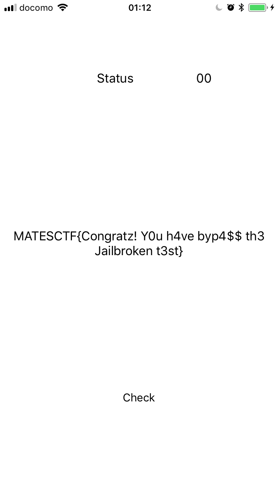

## Jailbreak

__Type:__ RE/iOS  

__Files:__  
[Jailbreak.ipa](Jailbreak.ipa)

## Solution:

You know the drill. Start with unpacking application and analysing app resources. Spoiler alert: nothing useful. So let's go right away to the static analysis of the binary.

First thing we have to notice is that it is arm64 only binary, so we will need respective device in case of dynamic analysis.

String search gives us some starting point for further digging.
```
000000010000dac0 "Your flag may appear here",
000000010000dada "01"
000000010000dadd "10"
000000010000dae0 "Sorry, you must change the status to something else"
000000010000db20 "MATESCTF{f4k3fl4G}"
000000010000db33 "11"
000000010000db36 "00"
```

If you dealt with CTFs before you can already kinda guess what the task expect us to do - there is some function that returns something, and we need to reverse it and see under what certain conditions it may do something with flag.

Let's investigate this "status" variable.

Before proceeding further with reversing, let's see if it is a stupidly easy task and if we can have an easy win. And by this I mean launching application, connecting to it with cycript and literally change status variable to other value to see if it will somehow affect the results.

Connecting cycript:
```
cycript -p Jailbreak
```

Reflection of main ViewController properties:
```ObjC
@<Jailbreak.ViewController: 0x145e1ad70>:
in Jailbreak.ViewController:
Properties:
@property (nonatomic, weak) UILabel* flagLabel;  (@synthesize flagLabel = flagLabel;)
@property (nonatomic, weak) UILabel* jbStatus;  (@synthesize jbStatus = jbStatus;)
Instance Methods:
- (id) flagLabel; (0x1000968c0)
- (void) setFlagLabel:(id)arg1; (0x10009697c)
- (id) jbStatus; (0x100096b5c)
- (void) setJbStatus:(id)arg1; (0x100096c18)
- (void) btnChecked:(id)arg1; (0x100097650)
- (^block) .cxx_destruct; (0x100098afc)
- (id) initWithCoder:(id)arg1; (0x1000994d0)
- (void) didReceiveMemoryWarning; (0x100096880)
- (id) initWithNibName:(id)arg1 bundle:(id)arg2; (0x100099024)
- (void) viewDidLoad; (0x1000967cc)
```

Changing properties in runtime:

```ObjC
[[[UIApplication sharedApplication] keyWindow] recursiveDescription]

r = [[[UIApplication sharedApplication] keyWindow] rootViewController]

[r theProperty]
[r theProperty].text = "00"
[r theProperty]
```

And it happens that the flag output is based on actual check before setting variable, and' that's good, it means challenge is not a crap.

Now after we established that, let's analyse the binary in Hopper, starting from our variable and flag-related strings.

And it looks like the strings for the flag output is in the function
```
int __T09Jailbreak14ViewControllerC10btnCheckedyypF(int arg0)
```
which is called on the button-press handler method
```
[_TtC9Jailbreak14ViewController btnChecked:]
```

Also we can notice Obfuscator class, or waste a lot of time statically reversing `__T09Jailbreak14ViewControllerC10btnCheckedyypF`  but we do not even care about it at this point, as there is already a way for a quick and easy solution that can be seen from the disassembly of `__T09Jailbreak14ViewControllerC10btnCheckedyypF`.

Let's look at the Control Flow Graph of this function, and color blocks in red that lead to an error, and in green that looks like they may be important for flag calculation output. And we need to reach the last block with:
```Asm
adrp       x8, #0x100011000 ; 0x1000115c8@PAGE
add        x8, x8, #0x5c8 ; 0x1000115c8@PAGEOFF, &@selector(setText:)
ldr        x1, [x8]     ; argument "selector" for method imp___stubs__objc_msgSend, "setText:",@selector(setText:)
ldr        x8, [sp, #0x2a0 + var_1E0]
mov        x0, x8       ; argument "instance" for method imp___stubs__objc_msgSend
ldr        x2, [sp, #0x2a0 + var_260]
bl         imp___stubs__objc_msgSend ; objc_msgSend
```

So we will get something like:  
[this.pdf](Jailbreak___T09Jailbreak14ViewControllerC10btnCheckedyypF.pdf)

Now we just attach the debugger, like this:
```
process attach --name Jailbreak

> breakpoint set --selector btnChecked:
Breakpoint 16: where = Jailbreak`@objc Jailbreak.ViewController.btnChecked(Any) -> (), address = 0x0000000100c5b650
```

Then trace inside the actual checking function, and "help" the control flow to reach needed block.

Jumping straight to flag output procedure did not work, so we need either rewrite jumps or directly set the ```pc``` register at the CFG branching. Fortunately there's not many of them so it can be done easily.

Doing that, we are greeted with a flag:



```
MATESCTF{Congratz! Y0u h4ve byp4$$ th3 Jaibroken t3st}
```

Done.
